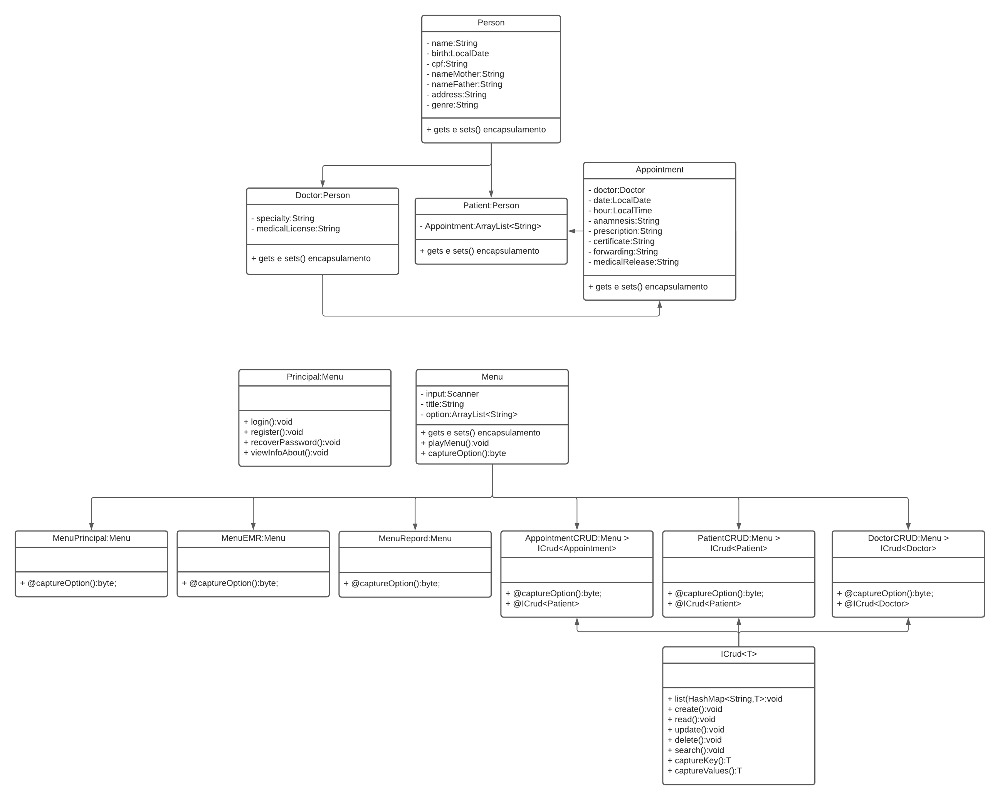

# Project EMR - Electronic Medical Record

📜 Tabela de conteúdos
=================
* [Sobre o projeto](#sobre-o-projeto)
* [Fluxograma da aplicação](#fluxograma)
* [Diagrama de classes](#diagrama)
* [Como executar o projeto](#-como-executar-o-projeto)
* [Tecnologias](#-tecnologias)  
* [Autores](#-autor)

 

---

## 💻 Sobre o projeto

Se trata de um sistema utilizado para realizar a gestão de atendimentos de uma clínica. Possui funcionalidades para realizar a gestão de pacientes com seus respectivos prontuários que por sua vez armazenam seus atendimentos.

 

---

## ⚙️ Fluxograma da Aplicação

O fluxo do sistema se baseia no conceito :
- Paciente ➡️ Prontuário ➡️ Atendimentos

 

----

## Diagrama de Classes
 

 

----

# Instruções para rodar o Projeto

1. Faça uma cópia do projeto para sua máquina: 
    - git clone https://github.com/seiler-emerson/Entra21_Project_EMR_2022.git
    - Ou um download direto da página [AQUI](https://github.com/seiler-emerson/Entra21_Project_EMR_2022).
    - Importe o projeto em sua IDE e execute a aplicação.
        - Tutorial de como importar um projeto na IDE Eclipse [AQUI](https://www.youtube.com/watch?v=R-8OF9ipeT8).
2. Execute via replit
    - ICONE COM LINK

 

---

## ⚒ Tecnologias e Conceitos

Neste projeto utiliZamos a linguagem JAVA e aplicamos os seguintes conceitos:

	
  
<b>💡&nbsp; Lógica de programação</b>

1. Git
    - Repositório
    - Documentação
    - README.md
    - Replit
2. Organização do projeto
    - Packages / sub-packages
    - Nomenclatura
3. Elementos básicos
    - variáveis
    - constantes
    - comentários
4. Estruturas de decisão
    - if, else-if, else
    - switch
5. Laços de repetição
    - for
    - while
    - do-while
6. Modularização
    - métodos com ou sem parâmetros e com ou sem retornos
    - recursividade

	
  
<b>🗃️&nbsp; Orientação a objetos</b>

  
1. Classes
    - diagrama de classe
    - atributos
    - construtores
    - encapsulamento
    - métodos específicos
    - instanciar objetos
2. Herança
    - extends
    - criar novos construtores com base na super classe
    - Polimorfismo
        - Apenas aproveitar os métodos
        - Fazer completamente de forma especifica
        - Sobrescrever para:
            - Fazer de forma especifica
            - Aproveitar o comportamento e fazer um complemento
3. Polimorfismo
    - interfaces

   
<b>⚠️&nbsp; Java avançado</b>

1. Classes wrapper
2. ENUM
3. Annotations
4. Collections
    - ArrayList
    - LinkedList
    - HashSet
    - HashMap
5. Funções Lambda
6. Generics
7. Dates
8. Exceptions

 

---

## 👷 Autores

 

    

        <a href="https://www.linkedin.com/in/B%C3%A1rbaraRibeiro050392/">
        
         
        <b>Bárbara Ribeiro</b></a> 
         

    

    <a href="https://www.linkedin.com/in/seileremerson/">
    
     
    <b>Emerson Seiler</b></a> 
     

    

    <a href="https://www.linkedin.com/in/welliton-borges-904331190/">
    
     
    <b>Welliton Borges</b></a> 
     

    

 

---
